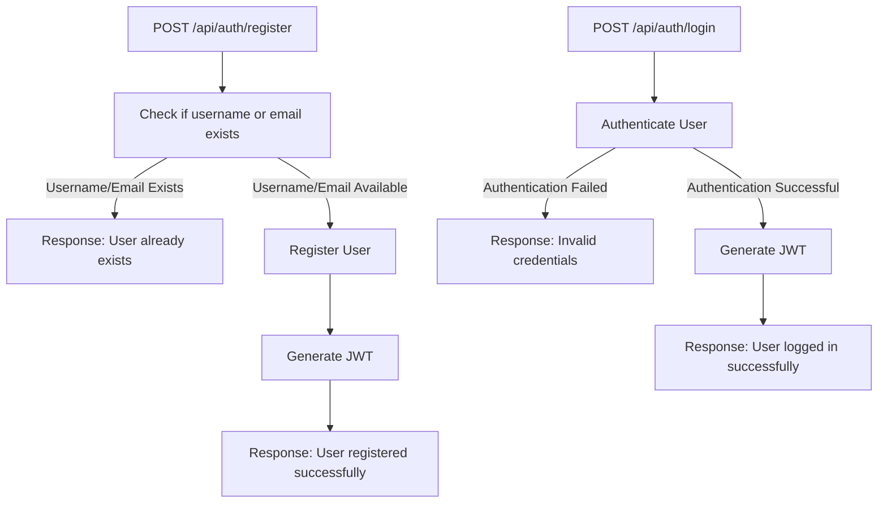

```mermaid
graph TD;
    A[POST /api/auth/register] --> B[Check if username or email exists]
    B -->|Username/Email Exists| C[Response: User already exists]
    B -->|Username/Email Available| D[Register User]
    D --> E[Generate JWT]
    E --> F[Response: User registered successfully]
    
    A1[POST /api/auth/login] --> B1[Authenticate User]
    B1 -->|Authentication Failed| C1[Response: Invalid credentials]
    B1 -->|Authentication Successful| D1[Generate JWT]
    D1 --> E1[Response: User logged in successfully]
```